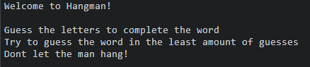
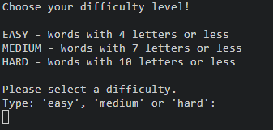
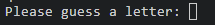
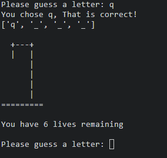
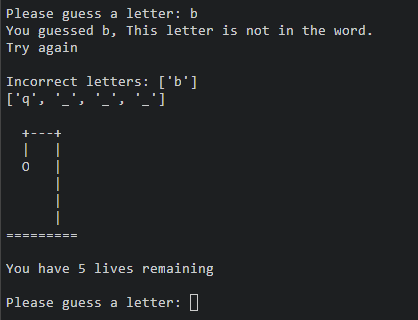
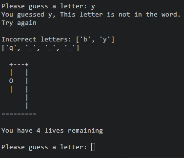
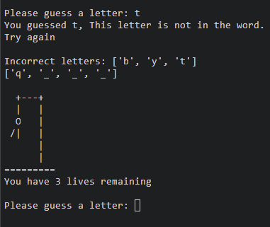
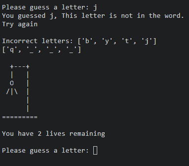
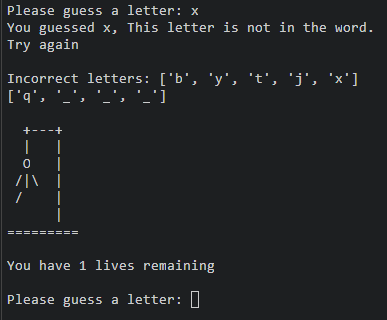
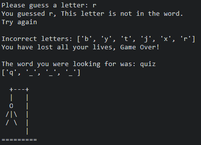

# Hangman

Hangman is a Python terminal game, which runs in a mock terminal on Heroku.

Hangman is a traditional wordgame in which users are given an unknown, randomly selected word and will attempt to solve the word without losing all their lives. 

In the tradintional hangman style, users are given visual cues which will show how close the man is to hanging. 

[View the live project here]()!!!!!!!!!!!!!!!!!!!!!!!!!!!!!!!!!!!!!!!!!!!!!!!!!!!

## User Experience (UX)

 - As a user, I want to be able to play the traditional wordgame hangman.
 - As a user, I want to be to myself and select from a variety of difficulty levels.
 - As a user, I want to be able to see how close I am to solving the word.
 - As a user, I want to be able to see how close I am from losing the game. 
 - As a user, I want to be able to store my high score.

## Features

### Opening Monologue

When the user starts the game, they are greeted with an openinig monologue. 

## Choosing the difficulty

After the opening monologue, the user will be asked to select the difficulty they would like to play. 

Difficulty choices

EASY
- If the user selects "easy", they will be move on to play with randomly selected words with four letters or less

MEDIUM
- If the user selects "medium", they will move on to play  with randomly selected words with 7 letters or less

HARD
- If the user selects "hard", they will move on to play  with randomly selected words with 10 letters or less

Users have been given this difficulty choice so they can feel like they are being challenged, not only against themsleves but also against others who play. 

## Letter Selection

Following on from the difficulty selection, The user will be prompted to start guessing letters. Presented before the user input, is the unknown random word that has been blanked out. This gives the user an indiction of how many letters are in the word. 

## Correctly guessed letters

Once the user has input their choice, they will receive feedback on whether or not the letter they have guessed is correct. 

If the user has guessed correctly, They are presented with a message stating that they have guessed correctly. The correct letter replaces the blank space and the classic hangman drawing is displayed along with how many lives they have remaining. From here the user will be prompted for their next guess. 

## Incorrectly guessed letters

If the user has guessed incorrectly, They will be presented with a message stating what letter they got wrong and that it is not not in the randomly selected word. 

The user will also see displayed a list with the incorrectly guessed letter so they now know not to use this letter in their remaining attempts. 

The hangman image is displayed with its first body part and another message stating how many lives the user has remaining. 

From here the user is prompted to make their next attempt. 

If the user keeps guessing incorrectly, The same messages and images will be display until they lose all their lives. 

## Losing the Game

 - If the user gets the stage in the game where they have incorrectly guessed letters, that they lose all their lives, the game will end.

- The user will be presented with a message stating that they have lost all their lives and the game is over.
- The user will also be presented with the completed word they were trying to guess 
- The final image of the hangman with all its body parts is displayed. 