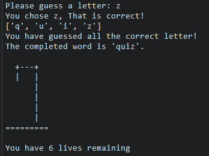
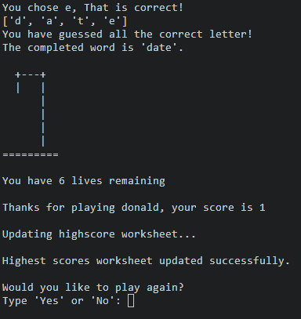
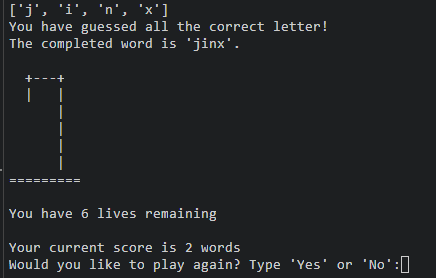
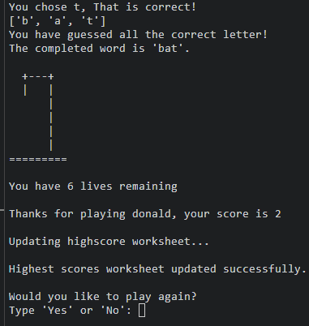
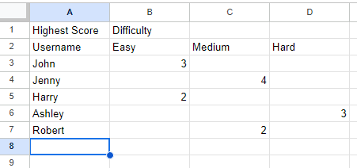
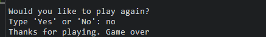
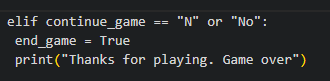
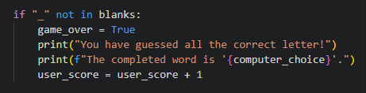

# Hangman

Hangman is a Python terminal game, which runs in a mock terminal on Heroku.

Hangman is a traditional wordgame in which users are given an unknown, randomly selected word and will attempt to solve the word without losing all their lives. 

In the tradintional hangman style, users are given visual cues which will show how close the man is to hanging. 

[View the live project here](https://hangmangamedonald-e8eff857df0e.herokuapp.com/)

## User Experience (UX)

 - As a user, I want to be able to play the traditional wordgame hangman.
 - As a user, I want to be to myself and select from a variety of difficulty levels.
 - As a user, I want to be able to see how close I am to solving the word.
 - As a user, I want to be able to see how close I am from losing the game. 
 - As a user, I want to be able to store my high score.

## Features

### Opening Monologue

When the user starts the game, they are greeted with an openinig monologue. 

### Enter your username
After the opening monolgue, users will be asked to enter their username. 
This user name is then stored for use later on when updating the scores to an external API

### Choosing the difficulty

After the opening monologue, the user will be asked to select the difficulty they would like to play. 

#### Difficulty choices

EASY
- If the user selects "easy", they will be move on to play with randomly selected words with four letters or less

MEDIUM
- If the user selects "medium", they will move on to play  with randomly selected words with 7 letters or less

HARD
- If the user selects "hard", they will move on to play  with randomly selected words with 10 letters or less

Users have been given this difficulty choice so they can feel like they are being challenged, not only against themsleves but also against others who play. 

### Letter Selection

Following on from the difficulty selection, The user will be prompted to start guessing letters. Presented before the user input, is the unknown random word that has been blanked out. This gives the user an indiction of how many letters are in the word. 

### Correctly guessed letters

Once the user has input their choice, they will receive feedback on whether or not the letter they have guessed is correct. 

If the user has guessed correctly, They are presented with a message stating that they have guessed correctly. The correct letter replaces the blank space and the classic hangman drawing is displayed along with how many lives they have remaining. From here the user will be prompted for their next guess. 

### Incorrectly guessed letters

If the user has guessed incorrectly, They will be presented with a message stating what letter they got wrong and that it is not not in the randomly selected word. 

The user will also see displayed a list with the incorrectly guessed letter so they now know not to use this letter in their remaining attempts. 

The hangman image is displayed with its first body part and another message stating how many lives the user has remaining. 

From here the user is prompted to make their next attempt. 

If the user keeps guessing incorrectly, The same messages and images will be display until they lose all their lives. 

### Losing the Game

 - If the user gets the stage in the game where they have incorrectly guessed letters, that they lose all their lives, the game will end.

- The user will be presented with a message stating that they have lost all their lives and the game is over.
- The user will also be presented with the completed word they were trying to guess 
- The final image of the hangman with all its body parts is displayed. 

### Winning the Game

- When the user has been able to guess all the correct letters in the random word, they will have won the game.

- The terminal will diplay all the blank letters completed with a message to notify the user that they have guesed all the correct letters and the completed word is displayed. 

### Accumulating Points

- Classic Hangman is a fairly straightforward game to play and depending on each individual user, can be played and completed relatively quickly. 
- To give the user a reason to keep playing after they have solved a word and staying engaged, a scoring system has been implemented to the game.

- On completion of a word, the user will be awarded a point and asked to input if they wish to play again. 

- If the user inputs "yes", another word will be randomly selected with a fresh set of lives and the hangman image starts at the beginning. 

- This will continue until the user decides to end the game or until they lose all their lives on an attemped solve. 

### Storing points

- Upon a user voluntarily ending the game or losing the game, they will then be prompted to input their name. 

- Once their name is entered into the terminal, Their name and highscore will be posted into a google sheets document via an API. 

### Updating the Score Sheet

- Like any game where user compete against one another, users will want to see their high score compared to other users. 

- To acheive this, a google sheets API has been implemented. 
- After each word has been solved, the Username and score is sent to an external google sheet where they can see their score according to which difficulty they have played. 

### Game Over

- The user will receive a message in the terminal stating that the game is over. 

## Testing

I have manually tested the project by doing the following:

- Passed the code through a PEP8 linter and confirmed there are no problems.
- I have given invalid inputs, such as non alphabetical charecters. eg numbers and special charecters
- tested the game functionality through my local terminal and the Heroku Terminal  

## Bugs

### Solved Bugs

1. 
- Within the play_again function, when the user was asked if they wantewd to play again, a "no" response would not end the game.

- What was happening in the continue_game variable was, python was reading the condition as "if continue game = "N", or, "No" = True". 
- To fix this, first the conditions were put into lowercase and "N" was removed. 

2.
- When iimplementing the score functionality, I had incremented the score to add one point after each letter had been solved.
- As I wanted the points to accumulate after each word was sloved, I moved this peice of code to be read after the word had been completed.

### Unsolved Bugs

- The only bug left within the game is when updating the score to the googlesheet, the score is updated after each word is solved. 
- I would like to have the score only update once all points have been accumulated. 
- This will be a future feature I would like to implement

## Deployment
The project was deployed using Code Institute's mock terminal for Heroku

The steps for deployment are as follows:

- Create a new Heroku app
- In the settings tab:
    - Reveal config vars
        - Enter "CREDS" into KEY field
        - Enter the contents of the creds.json file into teh VALUE field
        - Click "Add"
    - In a new config vars
        - Enter "PORT" into the KEY field
        - Enter "8000" into the VALUE field
        - Click "Add"
    - In the buidpacks section we need to add python and node.js
        - Click "Add buildpack"
        - Select "python"
        - Click "Add buildpack"
        - Click "Add buildpack"
        - Select "node.js"
        - Click "Add buildpack"
        - Ensure the build packs have python on the top and node.js undernearth. 
- In the deploy tab:
    - Select GitHub as the deploment method
        - Once connected, search for the repository name
        - Click "connect" to link up the repository code with Heroku
        - Under
    - In Manual deployment
        - Click "Deploy Branch"
        - This will display the deployment logs as the app is built
        - Once ready, click "View", which will take the user to the deployed link. 
- In the Deployed link, Click "Run Program" to start the program.
